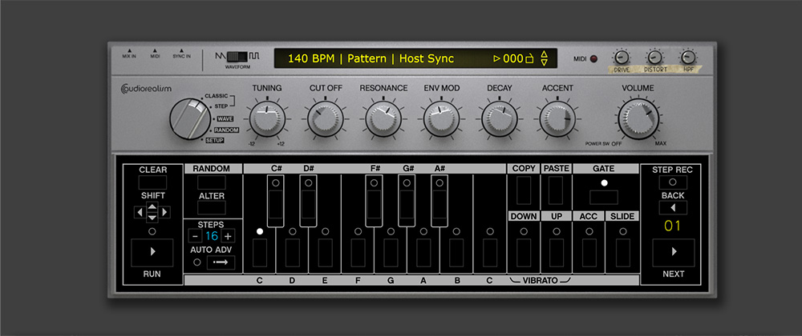
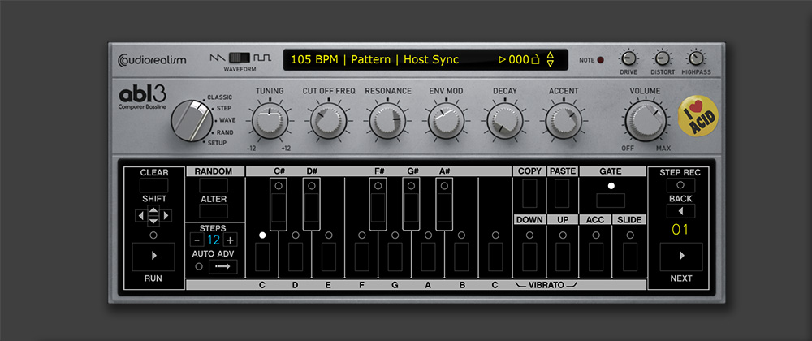
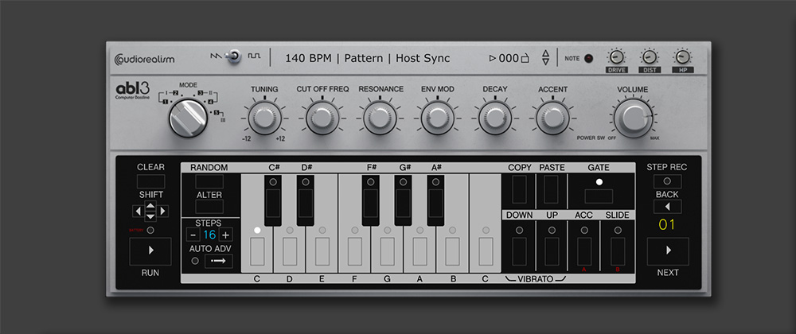
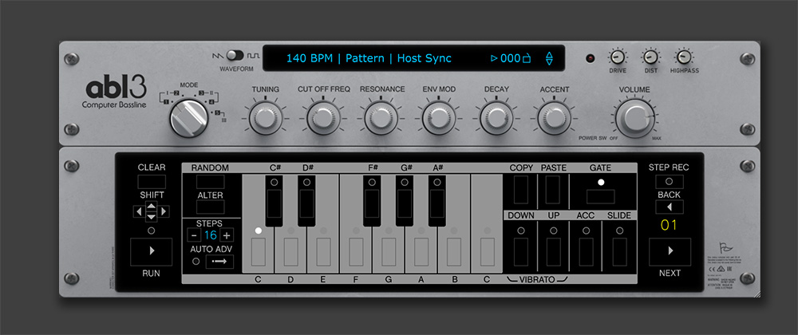

# ABL3 skins 

This is skins made for the 3.3 version of AudioRealism ABL3.

Instructions:

1.Download and unzip

2.Copy the .abl3skin file and the folder found in the zip-file to the ABL installation folder.

On Windows the ABL3 installation folder is:
c:\Users\<username>\Documents\AudioRealism\ABL3

On MacOs the default library path is:
/Library/Application Support/AudioRealism/ABL3/

3.Run ABL3 and choose the "select skin" from the application menu.

## SilverBox-1
Download: [ABL3-SilverBox-1.zip](ABL3-SilverBox-1.zip)

## SilverBox-2
Download: [ABL3-SilverBox-2.zip](ABL3-SilverBox-2.zip)

## SilverBox-3
Download: [ABL3-SilverBox-3.zip](ABL3-SilverBox-3.zip)

## SilverRack
Download: [ABL3-SilverRack.zip](ABL3-SilverRack.zip)

