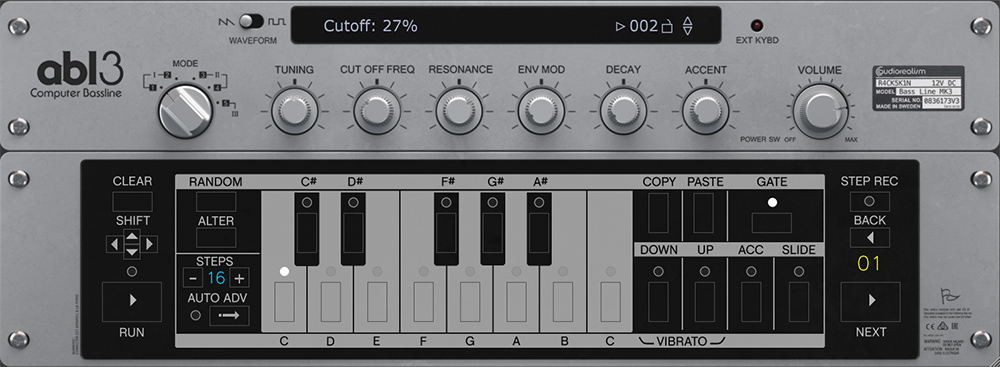
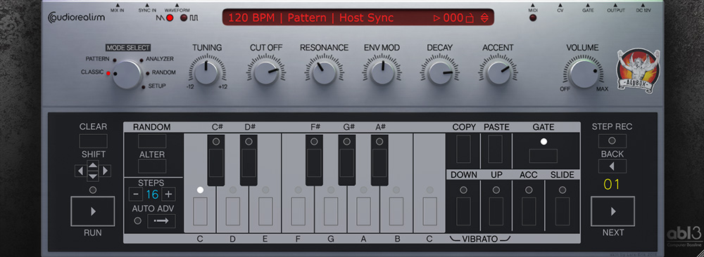
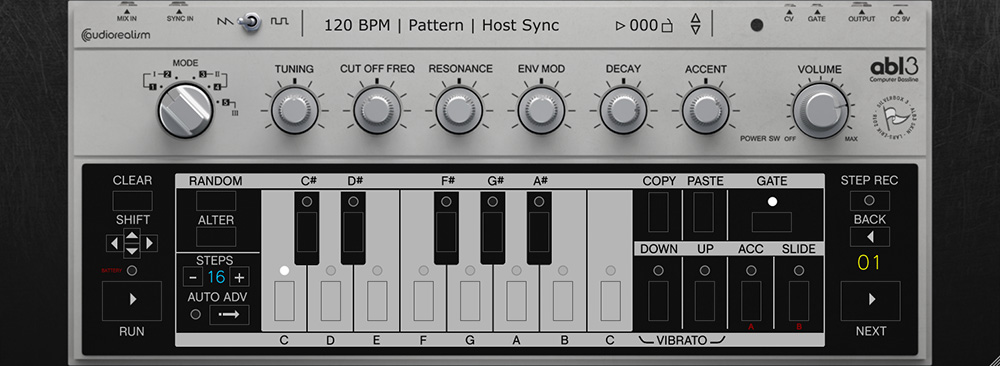
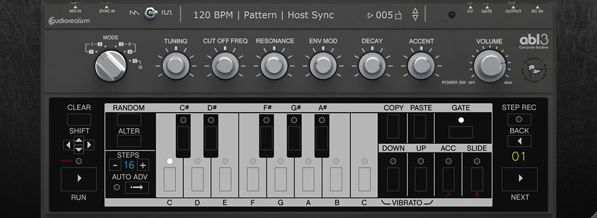
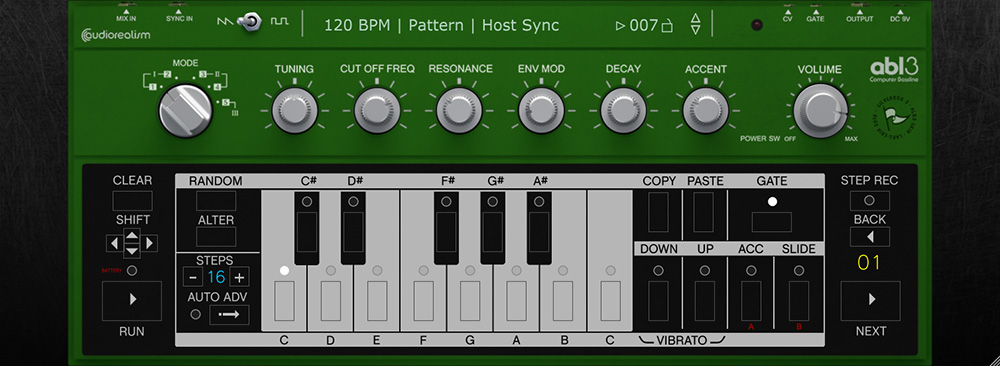
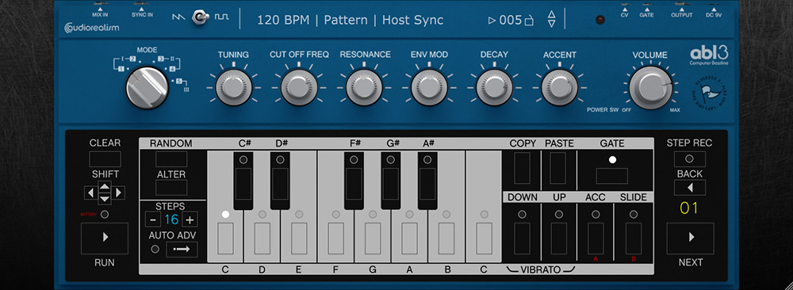

# ABL skins

## Instruction 
Download, unzip and copy the folder and the .abl3skin file found in the ZIP-file to your ABL3.2 
installation folder.

Default folder:

	Windows: C:\Users\<your user name>\Documents\AudioRealism\ABL3\
	MacOS: /Library/Application Support/AudioRealism/ABL3/
	
## Downloads

### R4ck5
Download: [abl3-skin-r4ck5.zip](abl3-skin-r4ck5.zip)

### AluBox

---
### SilverBox3

---
### SilverBox3 - Grey

---
### SilverBox3 - Green

---
### SilverBox3 - Blue

