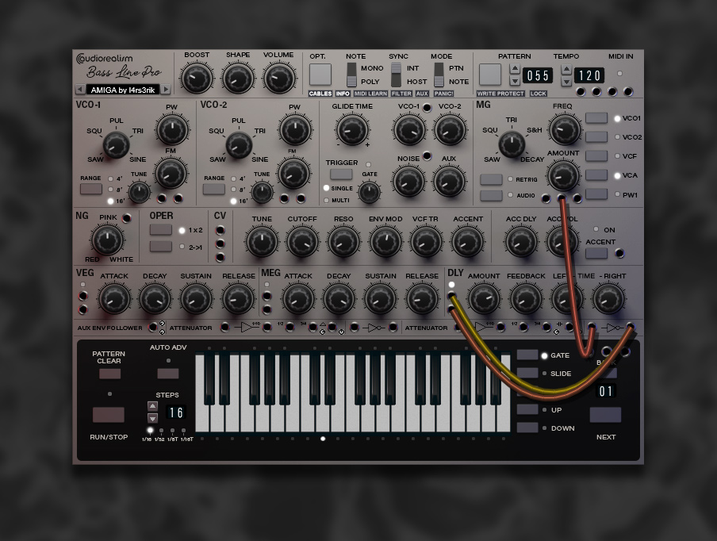

# ABL Pro 

Instructions:

1.Download and unzip

2.Copy the .skn file and the amigaGfx folder from the zip-file to the ABLPro installation folder.

On Windows the ABL3 installation folder is:
c:\Users\<username>\Documents\AudioRealism\ABL Pro\

3.Run ABL Pro and choose the "select skin" from the application menu.

## Amiga
Download: [ablpro-skin-amiga.zip](ablpro-skin-amiga.zip)

