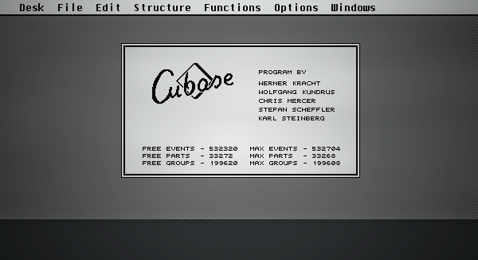

# Steinberg Cubase 

```
The Cubase Splash screen is a png image file so you can easily make a custom 

In a default setup of Cubase the startup splash screen graphics are stored here:
C:\Program Files\Steinberg\Cubase\Startup\

There are two versions of the same graphics depending on your screen resolution. To be on the safe side it's best to download both and let Cubase decide which one to use.

```
## Atari Cubase 

Download: 

[startup_cubase_pro.png](startup_cubase_pro.png)

[startup_cubase_pro_2.00x.png](startup_cubase_pro_2.00x.png)


