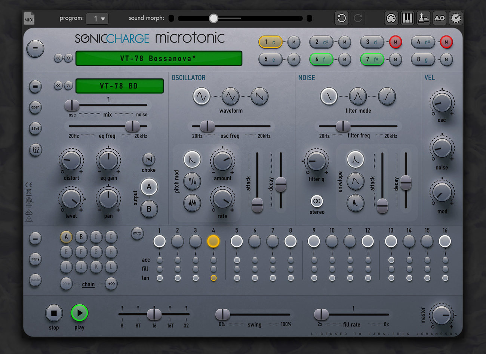
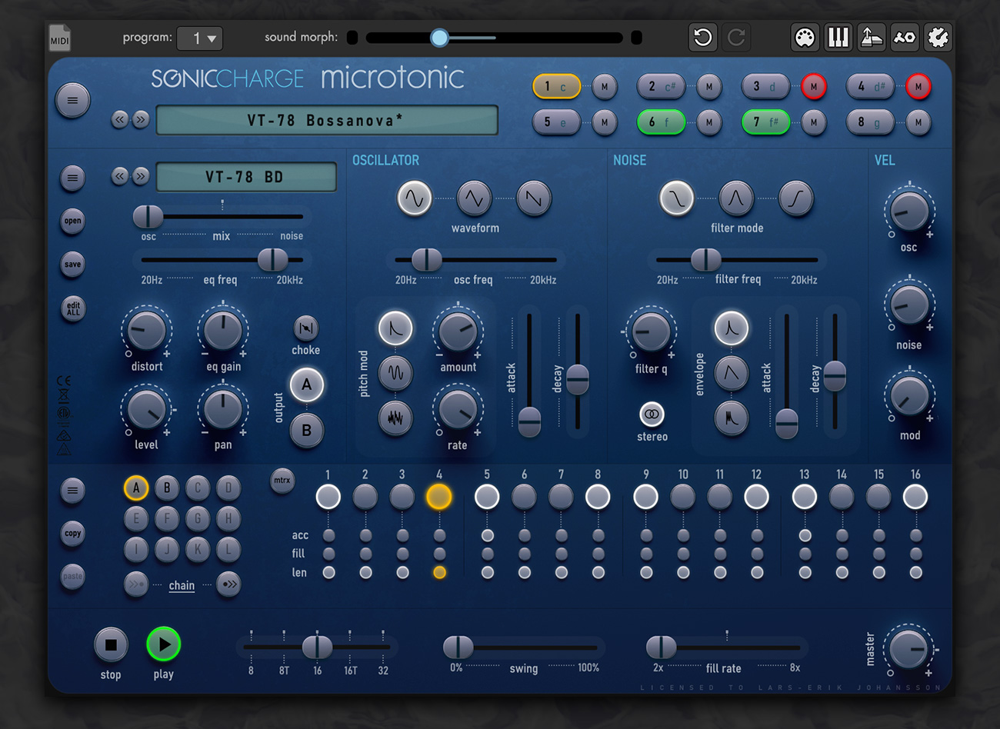
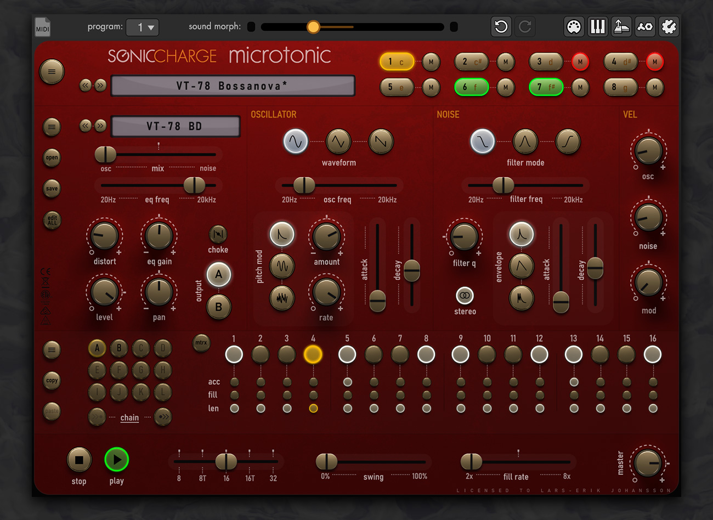

# Microtonic skins

In the Microtonic v3.3.2 public beta the skin format has changed and the good
people at soniccharge have created a public repository for skins.

I have submitted the skins to their repository and hoping they will accept my
pull request. 

https://github.com/fredli74/microtonic-skins

Previews of the skins:

## tonicA

## tonicB

## tonicR

## dark0ne

