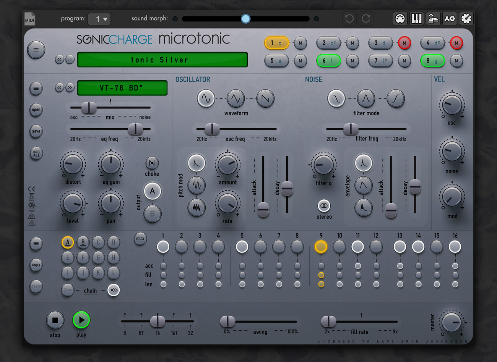
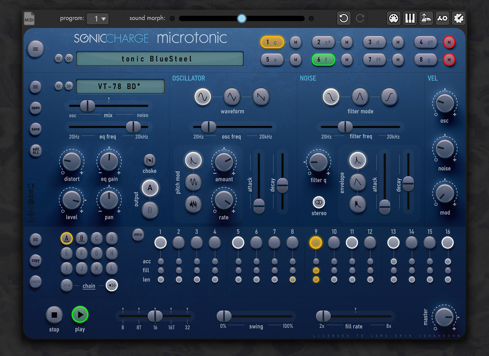
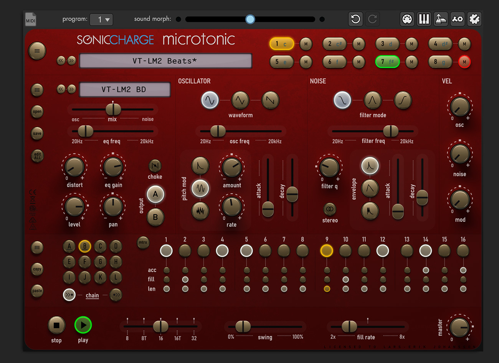
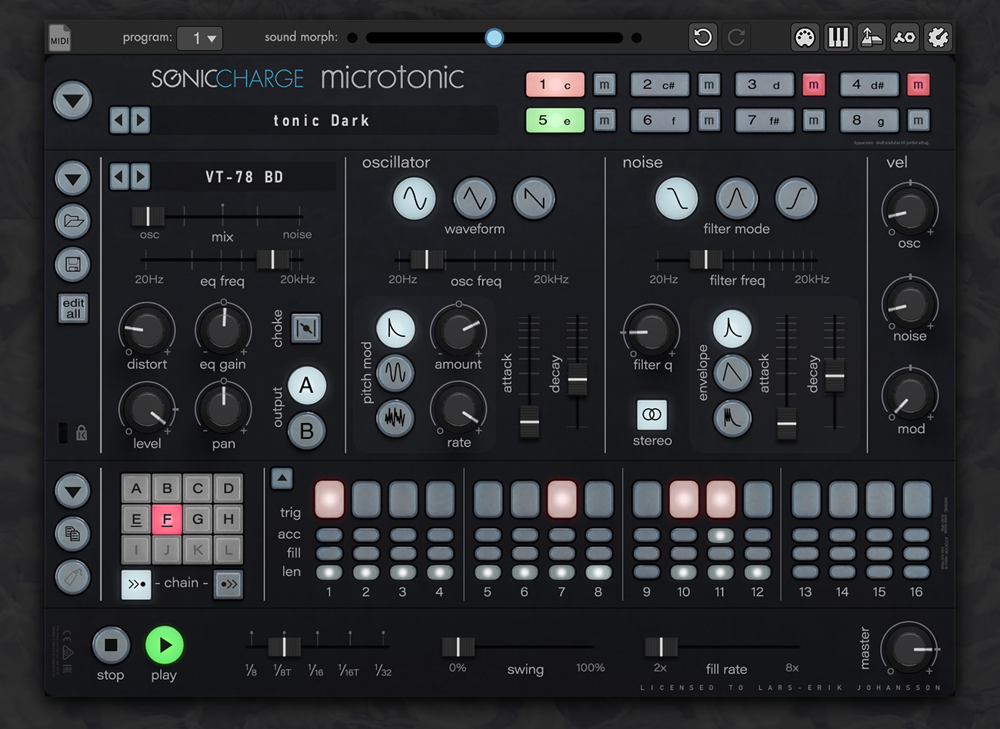

# Microtonic skins

## Instructions:

There are two ways of loading skins in Microtonic. Either way you need
to find the location of the Microtonic.vst (or Microtonic.component). 

In this folder you have two options. 

1. Create a folder named "Microtonic V3.3 Resources" and put the files 
   included in the skin here.
  
2. Create a text file named "Microtonic V3.3 Resources Path.txt" and in 
this text file write the full path to where you have the resource files 
stored.

For more details and information visit the Sonic Charge forum. The thread
https://soniccharge.com/forum/topic/1777-microtonic-v3-3-skinning is a good
start.

## Tonic Silver
Revision history:
  - 2021-02-15: Knobs improved contrast, new displayfont, softer licence font, slider backdrops tweaked, new knob markings, new morphleds.
  - 2021-02-02: New mute-button, improved channel button colors and license information font made smaller.
  - 2021-02-01: Updated mute-button look.
  - 2021-01-29: Pattern button bugfix.
  - 2021-01-28: First version.

Download: [larserik_tonicSilver.zip](larserik_tonicSilver.zip)

## Tonic Blue Steel
Revision history:
  - 2021-02-15: Knobs improved contrast, new displayfont, slider backdrops tweaked, new knob markings, new morphleds.
  - 2021-02-08: First version.

Download: [larserik_tonicBlueSteel.zip](larserik_tonicBlueSteel.zip)

## Tonic Magnum
Revision history:
  - 2021-02-17: Channel note graphics bugfix. 
  - 2021-02-15: Knobs improved contrast, new displayfont, slider backdrops tweaked, new knob markings, new morphleds.
  - 2021-02-10: First version.
  
Download: [larserik_tonicMagnum.zip](larserik_tonicMagnum.zip)

## Tonic Dark
Revision history:
  - 2021-02-02: Improved channel button colors and license information font made smaller.
  - 2021-01-13: Bugfix of buttons, improved pattern selection graphics.
  - 2021-01-12: First version
  
Download: [larserik_tonicDark.zip](larserik_tonicDark.zip)

