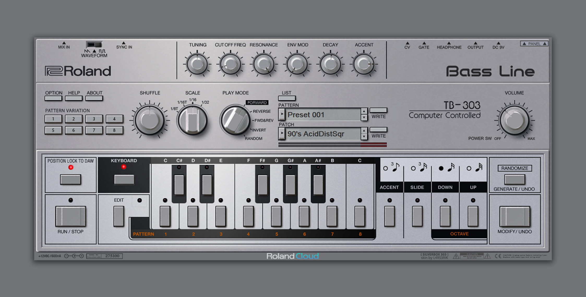

# Roland Cloud TB-303 skin
```
This skin was made for the 30 day trial version of the Roland TB-303 plugin. I have no idea if the Mac version of the has any library folder that makes it possible to replace the graphics.

Did some Silverbox skins for ABL some time ago and this is skin derived from the same set of 3D-models (knobs and switches). All animations are rendered in Blender 2.8 and then pixels has been moved around for countless hours in Photoshop making adjustments on the original files.

HowTo:

1. Download and unzip

2. Backup your Roland TB-303 script-folder (C:\Program Files\Roland VS\TB-303\Script) to make it easy to go back to the original graphics.

3. Copy the png files to the Roland TB-303 script folder (C:\Program Files\Roland VS\TB-303\Script) replacing the original files.

```
## TB-303 SilverBox 303 (version 0.9)
Download: [rolandcloud-tb303-silverbox.zip](rolandcloud-tb303-silverbox.zip)

