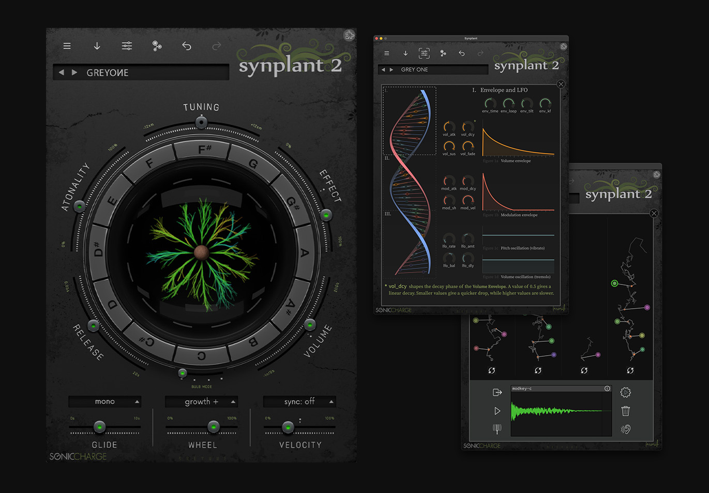

# Synplant2 skin

This is a skin for the Sonic Charge Synplant2 plug-in instrument. Best way to install is to download the official skin "Nightshift" from (found here: https://soniccharge.com/download) since this includes the nessesary scripts for switching between skins.

## Greyone (v1.1)
Download: [greyone.zip](greyone.zip)

