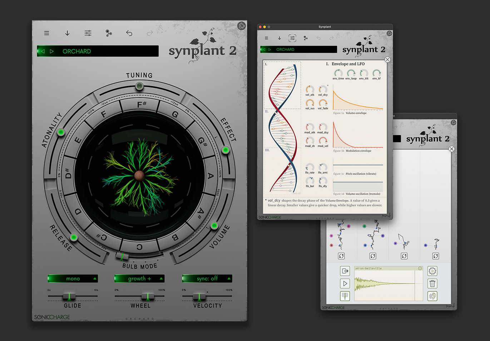

# Synplant2 skin
This is skins for the Sonic Charge Synplant2 plug-in instrument. Best way to install is to download a skinpack from SonicCharge to get the nessesary nessesary scripts for switching between skins.

## Orchard (v1.1)
Download: [orchard.zip](orchard.zip) 

## Greyone (v1.1)
Download: [greyone.zip](greyone.zip) 

